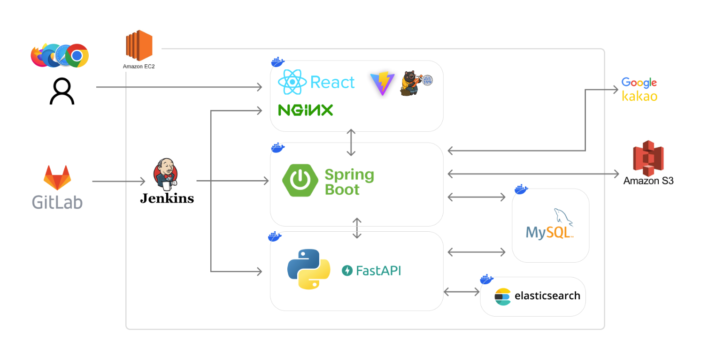
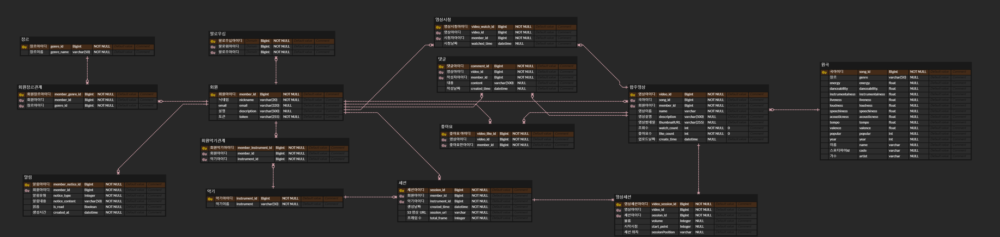
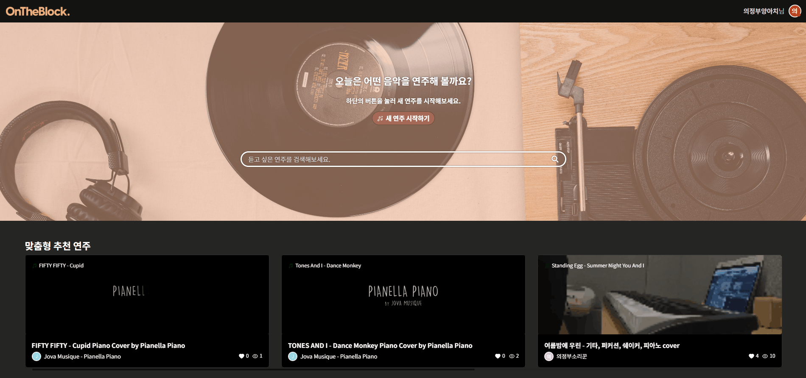
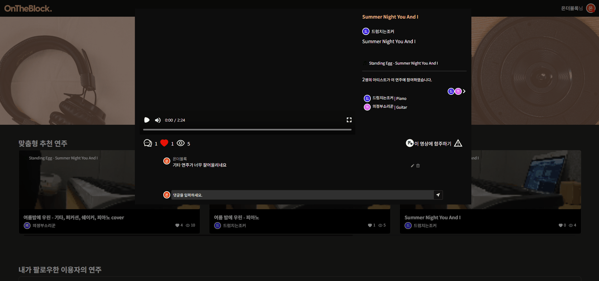
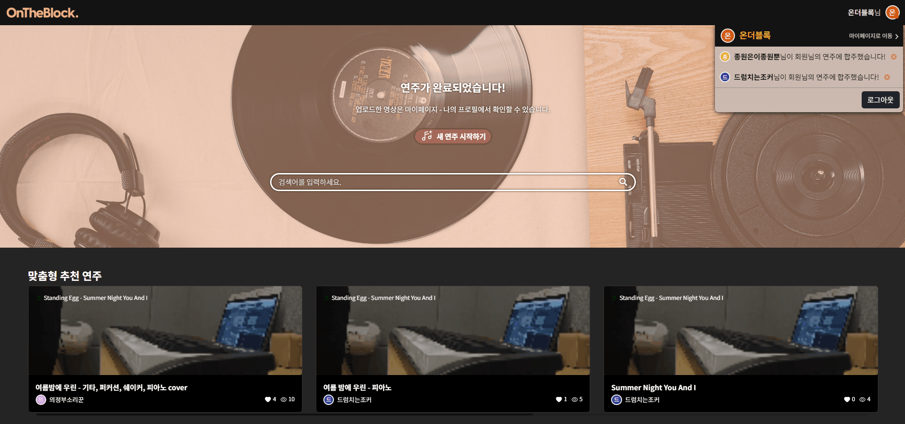

<b>“나의 소소한 연주가, 새로운 음악으로 다시 태어나는 플랫폼”</b>

 

    
    
    

OnTheBlock은 다양한 뮤지션들이 자신의 연주 영상을 공유하고,  연주 영상들을 하나의 합주 영상으로 만드는 서비스입니다. 
빅데이터를 활용하여 사용자별 음악 취향, 활동 내역에 따른 영상 추천 시스템을 제공하고,  
좋아요 / 댓글 / 팔로우를 통해 사용자들의 활발한 커뮤니케이션을 돕습니다.

&nbsp;  

    

    <b>[ 개발 기간 |</b> 2023. 08. 21. ~ 2023. 10. 06. <b>]</b>
    

    

        
<b>[ 도메인 |</b> 빅데이터 추천 시스템 <b>]</b>

        
(사용 데이터 : Spotify 곡 정보, 웹 서비스 내 등록된 영상 정보) 

    

     
    

        
<b>🏆 SSAFY 9기 특화 프로젝트 우수상 🏆</b>

        
<b>🎉 SSAFY 특화 프로젝트 UCC 경진대회 전국 1등 🎉</b>

    

    

        
📝<a href="https://dot-shift-674.notion.site/OnTheBlock-b739d2e8c70e41f08680c82ea193384a">관련 노션 페이지</a>

    

&nbsp;  
<!--
## 💡 핵심 기능

- 소셜 로그인(카카오, 구글)
- 솔로 연주 & 합주 시스템
- 키워드에 따른 검색 시스템
- 선호하는 악기, 유저별 취향 영상에 따른 추천 시스템
- SNS (댓글, 팔로잉, 실시간 알림 서비스)

## 🧑‍💻 추천 요소

- 선호하는 악기(회원가입)
- 선호하는 장르(회원가입)
- 시청한 영상(활동데이터)
- 좋아요한 영상(활동데이터)
- 업로드한 영상(활동데이터)
-->

## 🎬 프로젝트 소개 영상

(2분 10초부터 재생됩니다.)

## 📆 제작 기간 및 인원

제작 기간 : 2023. 08.21 ~ 2023. 10. 06 (7주)  
참여 인원 : 5인
||||||
|:--:|:--:|:--:|:--:|:--:|
|<a href="https://github.com/Jongwon97">이종원(팀장)</a>|<a href="https://github.com/AtomicLiquors">최효빈</a>|<a href="https://github.com/Park-jong">박종성</a>|<a href="https://github.com/JoonHeeSeo">서준희</a>|<a href="https://github.com/SilvianC">조태규</a>
|Backend, Frontend|Frontend, Design|CI/CD, 추천 시스템, Backend|Backend, Frontend|추천 시스템, 검색 시스템|

## 💻 기술 스택

### Backend

 

### Frontend

 

### CI/CD

### Server

 

## ERD

## 🔎 시연 영상

    <h3>1. 소셜 로그인</h3>
    <h3>2. 솔로 연주</h3>
    <h3>3. 합주</h3>
    <h3>3-1. 볼륨 조절</h3>
    <h3>3-2. 싱크 조절</h3>
    <h3>4. 영상 검색</h3>
    <h3>5. 추천 영상 조회</h3>
    <h3>6-1. 영상별 댓글 등록 및 조회</h3>
    <h3>6-2. 유저 팔로잉</h3>
    <h3>6-3. 실시간 소셜 알림</h3>

